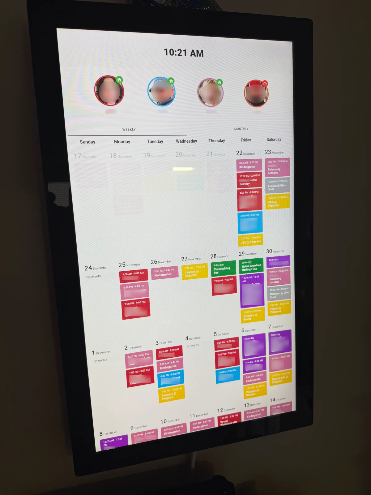

# Home Assistant Family Dashboard (or FamDash)

A family dashboard configuration for Home Assistant featuring a screensaver mode, person tracking, and integrated calendar views. Calendar events are assigned a color which coordinates with a person or all persons. The default view is scrollable and shown by the week. There is also a traditional monthly view where a day can be selected and all events are listed.



## Hardware
I run this on a Raspberry Pi 5 which is connected to a touch screen. I use [this 23.8" touchscreen display](https://www.amazon.com/dp/B088R62J92).

## Cards and entities used

The following custom cards are used to create the layout:

### 1. Wall Panel Mode
**HACS Search:** `wallpanel`
**Repository:** [https://github.com/j-a-n/lovelace-wallpanel](https://github.com/j-a-n/lovelace-wallpanel)
**Purpose:** Wall panel mode for your Home Assistant Dashboards

### 2. Simple Clock Card
**HACS Search:** `simple-clock-card`
**Repository:** [https://github.com/arnog/simple-clock-card](https://github.com/arnog/simple-clock-card)
**Purpose:** Displays clock in screensaver and main view

### 3. Stack In Card
**HACS Search:** `stack-in-card`
**Repository:** [https://github.com/custom-cards/stack-in-card](https://github.com/custom-cards/stack-in-card)
**Purpose:** Allows horizontal stacking of cards

### 4. Card Mod
**HACS Search:** `card-mod`
**Repository:** [https://github.com/thomasloven/lovelace-card-mod](https://github.com/thomasloven/lovelace-card-mod)
**Purpose:** Enables custom CSS styling for all cards

### 5. Mushroom Cards
**HACS Search:** `mushroom`
**Repository:** [https://github.com/piitaya/lovelace-mushroom](https://github.com/piitaya/lovelace-mushroom)
**Purpose:** Modern card designs for person entities and titles
**Cards Used:**
- `custom:mushroom-person-card`
- `custom:mushroom-title-card`

### 6. Week Planner Card
**HACS Search:** `week-planner-card`
**Repository:** [https://github.com/FamousWolf/week-planner-card](https://github.com/FamousWolf/week-planner-card)
**Purpose:** Displays weekly calendar view with multiple calendar sources

### 7. Tabbed Card
**HACS Search:** `tabbed-card`
**Repository:** [https://github.com/kinghat/tabbed-card](https://github.com/kinghat/tabbed-card)
**Purpose:** Creates tabbed interface for Weekly/Monthly calendar views

### 8. Atomic Calendar Revive
**HACS Search:** `atomic-calendar-revive`
**Repository:** [https://github.com/totaldebug/atomic-calendar-revive](https://github.com/totaldebug/atomic-calendar-revive)
**Purpose:** Displays monthly calendar view with event details

### 9. Layout Card (Grid Layout)
**HACS Search:** `layout-card`
**Repository:** [https://github.com/thomasloven/lovelace-layout-card](https://github.com/thomasloven/lovelace-layout-card)
**Purpose:** Provides custom grid layout system

Entities that need to be changed/provided:

### Input Booleans
Create the following input boolean in your `configuration.yaml` or through the UI. This works with the Wall panel mode, and it is used here to convert the display into a photoframe when not in use:
```yaml
input_boolean:
  wallpanel_screensaver:
    name: Wallpanel Screensaver
    icon: mdi:monitor
```

### Calendar Entities
The following calendar integrations should be configured:
- `calendar.family` - Family calendar for events shared between people.
- `calendar.person1` - Personal calendar for person1
- `calendar.person2` - Personal calendar for person2
- `calendar.person3` - Personal calendar for person3
- `calendar.holidays_in_united_states` - US Holidays
- `calendar.favorite_football_team` - Sports calendar
- `calendar.favorite_hockey_team` - Sports calendar

I pull our calendar from gmail, but feel free to use any calendar method in Home assistant, so long as it provided a calendar entity.

### Person Entities
Configure the following persons in Home Assistant:
- `person.person1`
- `person.person2`
- `person.person3`
- `person.person4`

You can click on each person's photo in the dashboard and it will give you their location. I am using iCloud3 to handle this on the backend.

Media files, or photos are stored here for the photoframe/screensaver:

### Screensaver Images
The wallpanel screensaver expects images to be located at:
```
/media/local/wallpanel/portraits/
```
I sort photos from a shared album in Apple Photos between portrait and landscape so that I can use these formats on other non-famdash devices.

Upload portrait-oriented photos in your method to this directory for the screensaver rotation.

## Theme

This dashboard uses the **Metro Blue** theme, but you can apply and adjust to any theme you like. 

## Customization

### Colors
Each person card has a custom border color defined in the configuration:
- person1: `#b82d3d` (red)
- person2: `#1badf8` (blue)
- person3: `#c57492` (pink)
- person4: `#d55c00` (orange)
- Family Event

### Screensaver Settings
Adjust these settings in `wallpanel.yml`:
- `idle_time`: Time before screensaver activates (default: 90 seconds)
- `image_order`: Image display order (random/sequential)
- `display_time`: Seconds per image (default: 7)

### Spacing, fonts, Etc.
The rest is controlled with card-mod.